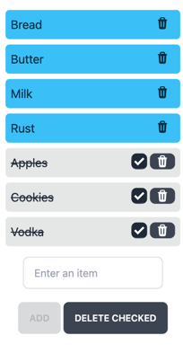

## Yew learning project

Spoiler: it's a shopping list.

You can try it [here](https://wasm-shopping-list.netlify.app/).

The app can also be installed as a PWA (Progressive Web App).

### To run:

* `yarn`
* `yarn build`
* `trunk serve`

